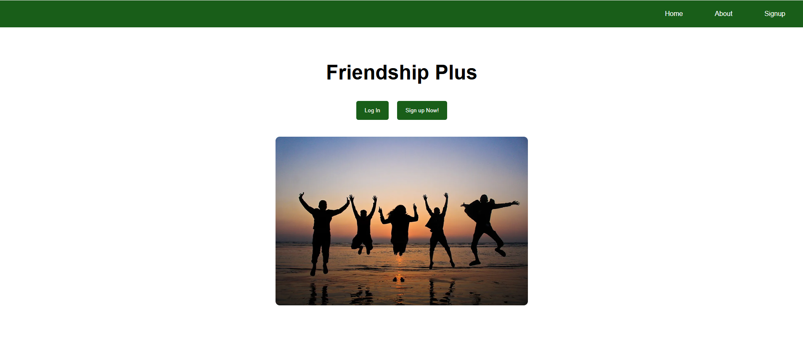
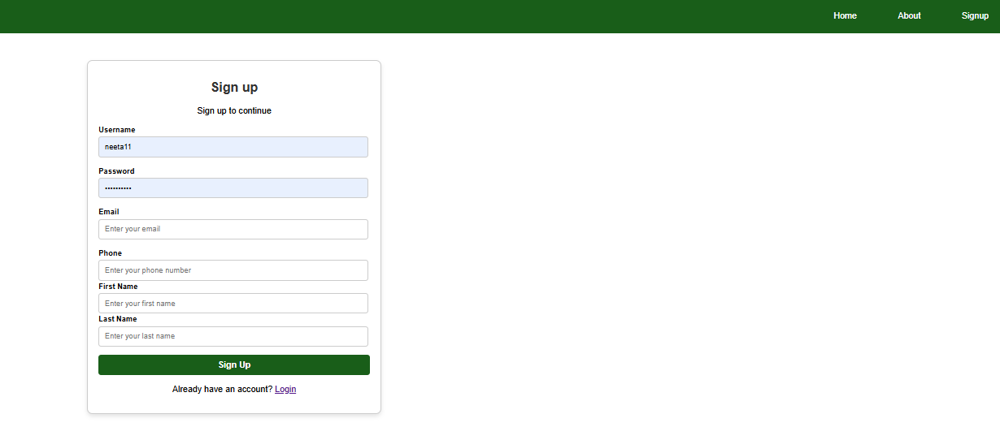
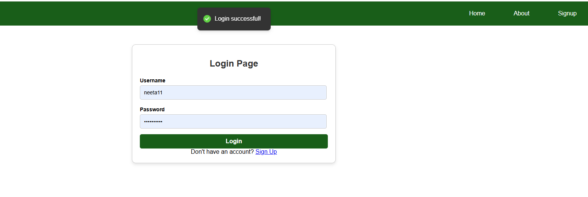
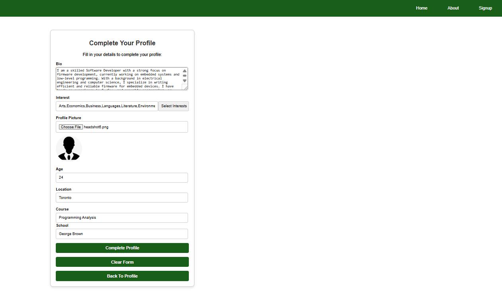
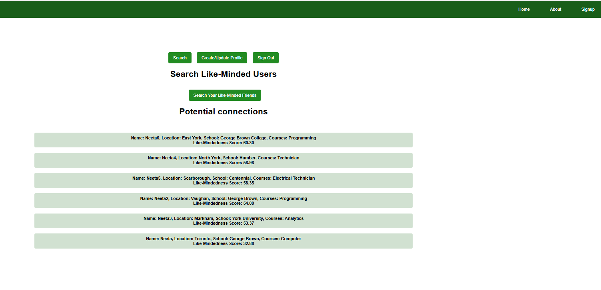

# Welcome to the Frontend of Friendship Plus

## About
Friendship Plus is an application designed to help post-secondary students create meaningful friendships.

## How to Run
To run the project, open your terminal and execute the following commands:

```
npm install
npm start
```

The application will start and be accessible at **http://localhost:3000**.

---

## Group Members
- Kevin Bhangu
- Jaskiran Gill
- Ian McDonald
- Neeta Pant

## Home View


## Sign-Up View



## Login View


## Create Profile View


## Select Interests View


## Profile View


## Search Likeminded Friends View

